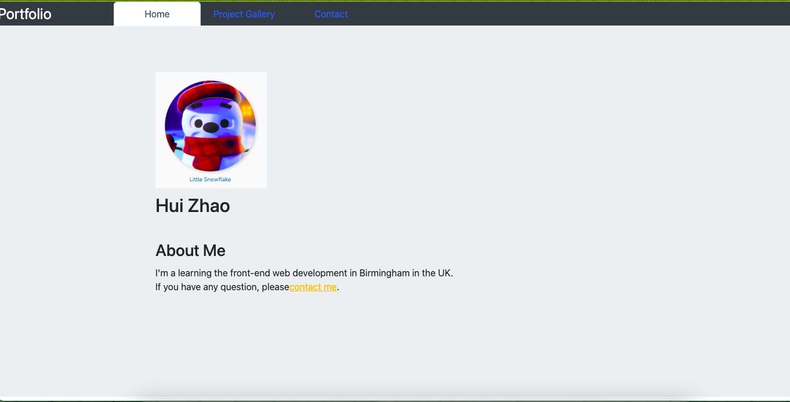
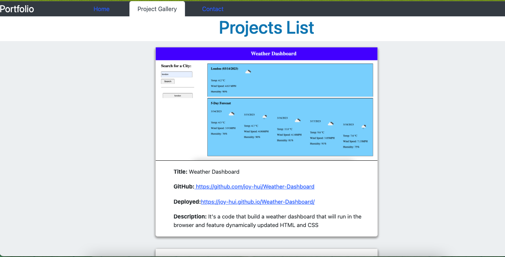
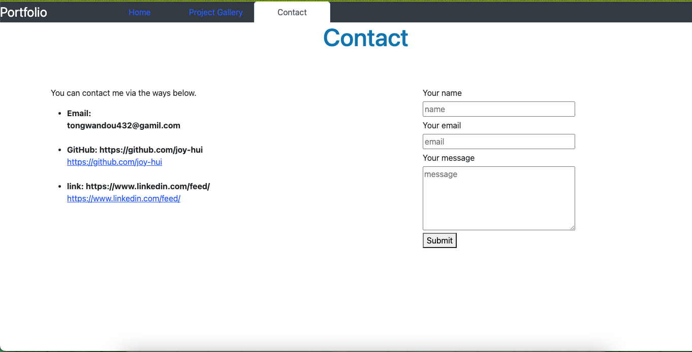

# React-Portfolio

## Description
* It's my portfolio using React.

## Acceptance Criteria
* There are three parts:
    * Home
        * a welcome landing page, including name,headshot.
    * Project Gallery
        * my projects
    * Contact
        * my contact information and contact form
 
## Table of Contents 

* [Installation](#installation)

* [Usage](#usage)

* [License](#license)

* [Contributing](#contributing)

* [Questions](#questions)

## Installation
* You can create one by running npm init when you first set up the project, before installing any dependencies.
* The command should be run to install dependencies: npm i

## Usage
* The application will be invoked by using the following command: npm start.
* There are some screenshots

## License

MIT
  
## Contributing
A way to creat portfolio.

## Questions

If you have any questions please contact me, my email address is tongwandou432@gamil.com. 
This is my github: [Joy](https://github.com/joy-hui).

